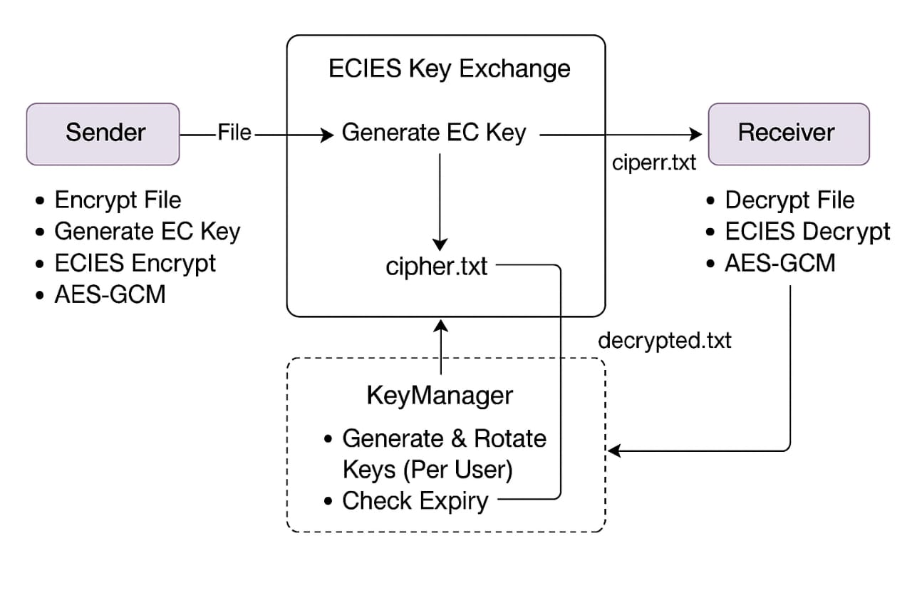

# 🔐 KeyCrypt Shield

**Robust Encryption, Key Rotation, and Secure File Shredding Framework**

KeyCrypt Shield is a comprehensive file-level encryption system that combines Elliptic Curve Integrated Encryption Scheme (ECIES), AES-GCM symmetric encryption, automated key rotation, and secure file shredding. This system is built to provide scalable, high-performance, and forward-secure data protection.

## 🚀 Features

- 🔑 **ECIES** for secure asymmetric key exchange
- 🛡️ **AES-GCM** for authenticated encryption with confidentiality & integrity
- 🔁 **Automated Key Rotation** every 30 days via KeyManager
- 🧨 **Secure Shredding** of original files post-encryption
- 📊 **Performance benchmarking** against traditional algorithms (RSA)
- 📂 **Lightweight & memory-efficient** design with Python
- 📎 Suitable for **cloud**, **IoT**, and **enterprise** deployments

---

## 🧠 System Architecture

- **Key Exchange**: ECIES using SECP256R1 + Diffie-Hellman
- **Symmetric Key Derivation**: HKDF with SHA-256
- **Encryption**: AES-GCM with IV and tag
- **Shredding**: Multi-pass file overwrite + deletion


*Fig: High-Level Encryption Workflow*

---

## 📁 Project Structure

| File | Description |
|------|-------------|
| `KeyCrypt_Shield.ipynb` | Jupyter notebook with full implementation |
| `cipher.txt` | Output of encrypted file |
| `decrypted.txt` | Output after decryption |
| `example.txt` | Sample input text |
| `encryption_flow.jpg` | Visual diagram of ECIES + Key Rotation flow |
| `Workflow_Diagram.jpg` | System architecture and secure deletion diagram |
| `performance_plot.png` | Benchmark results (ECIES vs RSA) |
| `image.png` | Project visual (for documentation use) |
| `README.md` | This file |

---

## 🔬 Performance Metrics

| Metric | RSA (2048-bit) | ECIES + AES-GCM |
|--------|----------------|------------------|
| Encryption Time | 45–60 ms | 12–18 ms |
| Decryption Time | 35–50 ms | 10–15 ms |
| Memory Usage | 10 MB | 6 MB |
| Throughput | 8 files/sec | 18–25 files/sec |
| Ciphertext Size | Large | Compact |
| Key Rotation | Manual | Automated |
| File Deletion | Not Included | Secure Shredding |

---

## 🔐 Security Highlights

- Ephemeral keys for forward secrecy
- AES-GCM ensures authentication and integrity
- Periodic key expiry limits exposure
- Secure file overwrite prevents data recovery
- Defense against MITM, brute-force, and replay attacks

---

## 🛠 Requirements

- Python 3.7+
- `cryptography` package
- `os`, `json`, `time`, `secrets`, `matplotlib` (for plotting)

Install dependencies:
```bash
pip install cryptography matplotlib
